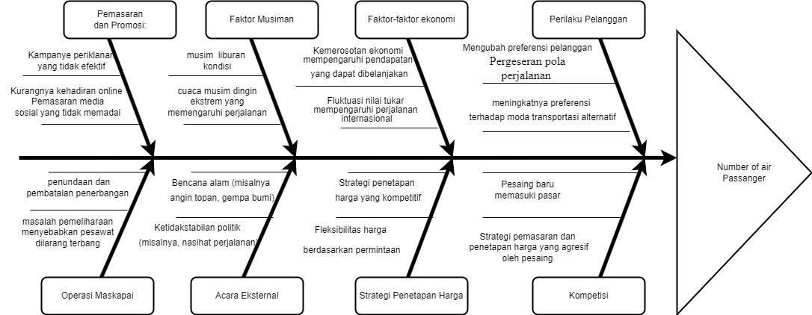

# number-of-air-passenger-arima-forcasting-

Identifikasi masalah
diagram fishbone ini membantu mengidentifikasi dan mengkategorikan berbagai faktor yang dapat mempengaruhi jumlah penumpang udara per bulan. Ini adalah alat visual untuk analisis akar permasalahan dan penyelesaian masalah dalam konteks fluktuasi jumlah penumpang udara

